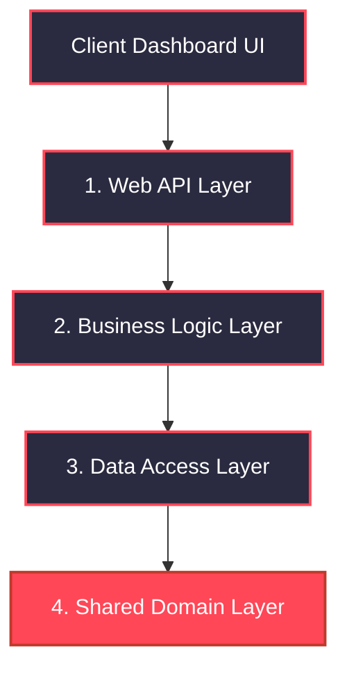

# OSINT Collection & Analysis System

An enterprise-grade, data-analytical OSINT (Open Source Intelligence) platform built using an asynchronous, loosely coupled N-Tier (Clean Architecture) design pattern with .NET 8 and Entity Framework Core.

The system provides intelligence collection orchestration, automated risk-score indexing, relational network topology compilation, and secure JWT-based identity delegation. It includes a dark-mode frontend dashboard that renders intelligence data using physics-based network graphs (vis.js).

## Architectural Topology

The solution enforces a strict Separation of Concerns (SoC) by dividing the codebase into four isolated projects. Dependencies flow inwards toward the core domain models, ensuring that business rules are completely independent of database technologies or user interfaces.



  
### 1. Presentation Layer (Api)

The entry point of the application exposed via a RESTful API. It is responsible for handling HTTP requests, bootstrapping dependency injection, managing the authentication middleware pipeline, and serving static files.

* **Controllers**: AuthController, AnalysisController, IndividualController, RelationController.
* **Middlewares & Filters**: Intercepts cross-cutting concerns globally (e.g., custom logging and exceptions).

### 2. Business Logic Layer (Business)

The "brain" of the platform. This layer contains the core application workflows, analytical logic, risk calculation engines, and mock external service aggregators. It remains completely decoupled from SQL infrastructure.

* **Services**: IndividualService, OsintScraperService, UserService, JwtService, RelationService, PhoneNumberService.
* **Domain Exceptions**: Implements unique domain exception mappings (NotFoundException, ConflictException, ValidationException).

### 3. Data Access Layer (DAL)

Encapsulates all persistence mechanics. This layer leverages Entity Framework Core with SQL Server to execute data queries. It implements architectural abstractions to hide EF-specific logic from upper layers.

* **Infrastructure**: IndividualsDbContext, UnitOfWork, ExpressionExtensions.
* **Repositories**: Complete implementation of the Repository Pattern for atomic data control.

### 4. Shared Infrastructure Layer (Shared)

A zero-dependency project that contains static domain items used uniformly across the lifecycle of a request.

* **Models**: Relational data structures (Individual, User, Relation, City, PhoneNumber).
* **DTOs**: Segmented into strict Command DTOs (write payloads) and Query DTOs (read payloads) to enforce data boundaries.
* **Custom Attributes**: Declarative data-validation rules (ValidateName, ValidatePersonalNumber).

## Advanced Technical Implementation Details

### Atomic Request Transactions (Unit of Work)

To avoid partial data writes or corruption during multi-step intelligence gathering (e.g., creating a primary individual, creating missing relation "ghost" profiles, and linking connection edges), the system leverages explicit database transactions.

```csharp
await _unitOfWork.BeginTransactionAsync();
try 
{
    var newId = await _individualService.AddIndividualAsync(scrapedDto);
    // ... orchestrate relations ...
    await _unitOfWork.SaveChangesAsync();
    await _unitOfWork.CommitTransactionAsync();
} 
catch 
{
    await _unitOfWork.RollbackTransactionAsync();
    throw;
}
```
  
### Multi-Tier Security & Token Validation Pipeline

Instead of relying strictly on basic role checking, the application implements a multi-layered middleware bouncer. When a client requests a resource:

* **UseAuthentication()**: Validates the cryptographic signature, expiration, issuer, and audience of the incoming bearer JWT.
* **UseMiddleware<UserValidationMiddleware>()**: Intercepts the request, extracts the user ID and role embedded inside the claims, calls the IUserRepository directly against the database, and verifies that the user profile has not been altered or revoked since the token was issued.
* **UseAuthorization()**: Checks strict policy claims (AdminOnly, AnalystLevel) before permitting controller execution.

### Dynamic Query Composition (Expression Tree Combination)

To enable complex analytical filtering across the database without writing boilerplate query conditions, the system uses a custom static extension utility to explicitly combine LINQ expressions using native Expression.AndAlso mapping trees.

### Global Enterprise Exception Lifecycle

No raw backend errors or stack traces are ever leaked to the user. A global ExceptionLoggingMiddleware sits at the top of the HTTP pipeline. It maps custom domain exceptions, catches database anomalies (like unique index violations), logs the fault to the console, and parses the outcome into a standardized, compliant JSON response object including an automated client TraceId.

## Database Schema Blueprint

The architecture implements database indexing constraints explicitly configured using the Entity Framework Fluent API inside OnModelCreating:

* **Individual**: Holds primary subject records. Features a unique database constraint on the PersonalNumber property.
* **PhoneNumber**: Relates to Individual with a Cascade Delete constraint. Features a global unique index across numbers to prevent duplicates.
* **Relation**: Models directional network topology links between targets. Implements a self-referencing many-to-many lookup table configured with DeleteBehavior.Restrict on target IDs to prevent dependency loops.
* **City**: Static lookup table implicitly pre-seeded during the migration state.
* **User**: System identities with base64 cryptographically salted and hashed passwords (SHA256).

## Quickstart and Setup

### Prerequisites

* .NET 8.0 SDK
* LocalDB or SQL Server Express
* Visual Studio 2022

### 1. Environment Configuration

Update the appsettings.json file inside the Api project directory to map your local environment configurations:

  ```markdown
  {
    "ConnectionStrings": {
      "DefaultConnection": "Server=(localdb)\\mssqllocaldb;Database=OsintAnalyticalDb;Trusted_Connection=True;MultipleActiveResultSets=true;Encrypt=False"
    },
    "JwtSettings": {
      "Secret": "DEVELOPMENT_SECRET_KEY_MUST_BE_LONG_ENOUGH_FOR_HMACSHA256",
      "Issuer": "Project",
      "Audience": "Users",
      "ExpiryMinutes": "60"
    }
  }
```

### 2. Apply Database Migrations
  Open the Package Manager Console inside Visual Studio, change the Default Project to DAL, ensure Api is set as your Solution Startup Project, and run:
  ```
 
  Bash
  Update-Database
 ```
  This will automatically instantiate the SQL database, prepare tables, and seed the default user (admin / Admin123!) and cities.

### 3. Execution
  Press F5 to build and run the system.
  
  Access the Swagger interface via: https://localhost:*port*/swagger
  
  Access the main visual analytical dashboard via: https://localhost:*port*/index.html
